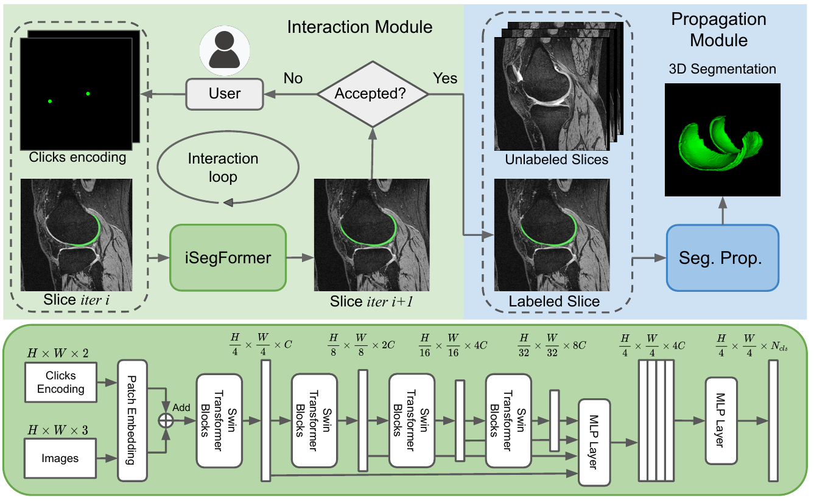

## [iSegFormer: Interactive Image Segmentation via Transformers with Application to 3D Knee MR Images](https://arxiv.org/abs/2112.11325)
<p align="center">
    <a href="https://arxiv.org/abs/2112.11325">
        
    </a>
    <a href="https://colab.research.google.com/github/qinliuliuqin/iSegFormer/blob/main/notebooks/colab_test_isegformer.ipynb">
        
    </a>
    <a href="https://opensource.org/licenses/MIT">
        
    </a>
</p>

<p align="center">
  
</p>

## Installation
If you want to test our models remotely, run this [colab notebook](https://colab.research.google.com/github/qinliuliuqin/iSegFormer/blob/main/notebooks/colab_test_isegformer.ipynb
). Otherwise, you have to download our codebase and install it locally.

This framework is built using Python 3.9 and relies on the PyTorch 1.4.0+. The following command installs all 
necessary packages:

```.bash
pip3 install -r requirements.txt
```
If you want to run training or testing, you must configure the paths to the datasets in [config.yml](config.yml).

## Evaluation
First, download the [datasets and pretrained weights](https://github.com/qinliuliuqin/iSegFormer/releases) and run the following code for evaluation:
```
python scripts/evaluate_model.py NoBRS \
--gpu 0 \
--checkpoint=./weights/imagenet21k_pretrain_cocolvis_finetune_segformerb5_epoch_54.pth \
--dataset=OAIZIB
```

## Training
Train the Swin-B model on the OAIZIB dataset.
```
python train.py models/iter_mask/swinformer_large_oaizib_itermask.py \
--batch-size=22 \
--gpu=0
```

## Model Weights
We released two models: Swin-B and HRNet32 that can be downloaded in the [release page](https://github.com/qinliuliuqin/iSegFormer/releases).

<!-- ## Datasets
[OAI-ZIB-test](https://github.com/qinliuliuqin/iSegFormer/releases/download/v0.1/OAI-ZIB-test.zip) \
[BraTS20](https://drive.google.com/drive/folders/12iSwrI2M98pV7s_5hOrp9r-PELlQzWOq?usp=sharing) \
[ssTEM](https://github.com/unidesigner/groundtruth-drosophila-vnc/tree/master/stack1/raw)
 -->
<!-- ## Video Demos
The following two demos are out of date.
[Demo 1: OAI Knee](https://drive.google.com/file/d/1HyQsWYA6aG7I5C57b8ZTczNrW9OR6ZDS/view?usp=sharing) \
[Demo 2: ssTEM](https://drive.google.com/file/d/1dZL91P2rDEQqrlHQi2XaTlnY1rmWezNF/view?usp=sharing)
 -->
 
## License
The code is released under the MIT License. It is a short, permissive software license. Basically, you can do whatever you want as long as you include the original copyright and license notice in any copy of the software/source. 

## Citation
```
@article{liu2021isegformer,
  title={iSegFormer: Interactive Image Segmentation via Transformers with Application to 3D Knee MR Images},
  author={Liu, Qin and Xu, Zhenlin, and Jiao, Yining and Niethammer, Marc},
  journal={arXiv preprint arXiv:2112.11325},
  year={2021}
}
```
