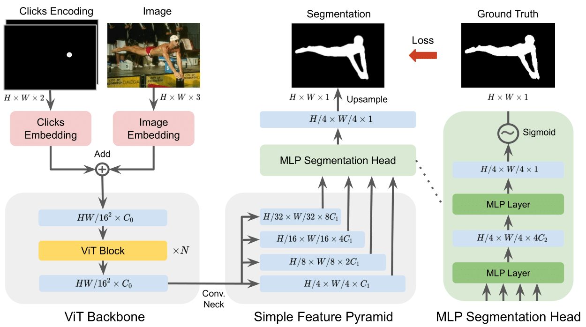

## [SimpleClick: Interactive Image Segmentation with Simple Vision Transformers](https://arxiv.org)

    
    

  

## Download 
Pre-trained SimpleClick models: [Google Drive](https://drive.google.com/drive/folders/1qpK0gtAPkVMF7VC42UA9XF4xMWr5KJmL?usp=sharing)

## Notes
This repository is under active development.

## License
The code is released under the MIT License. It is a short, permissive software license. Basically, you can do whatever you want as long as you include the original copyright and license notice in any copy of the software/source. 
